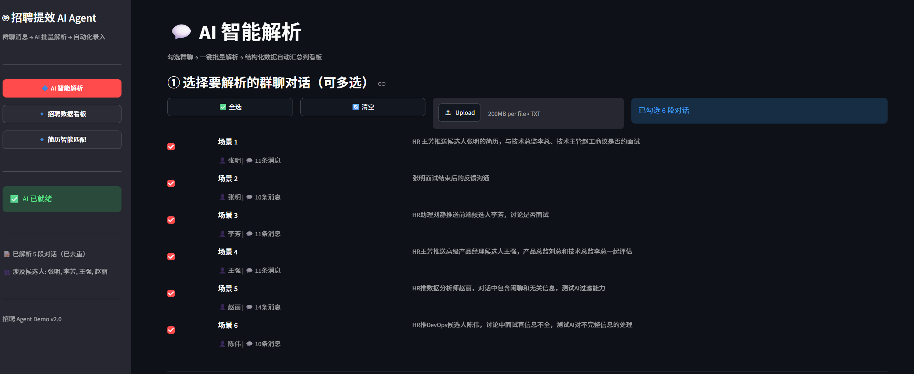
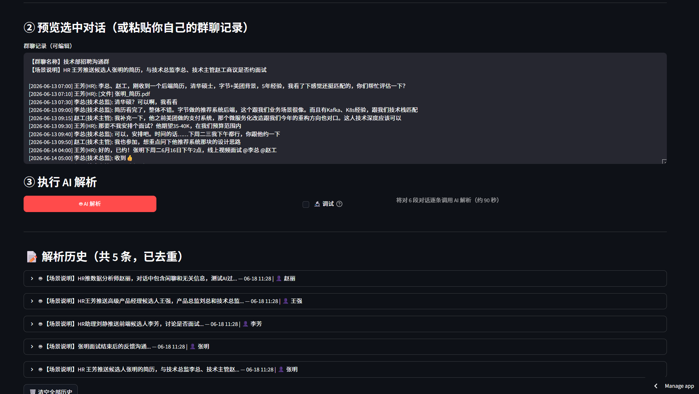
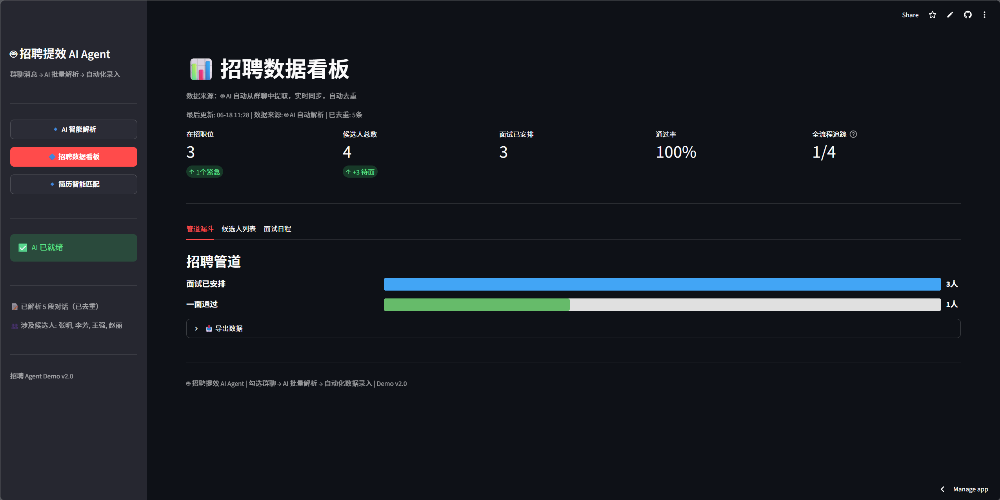
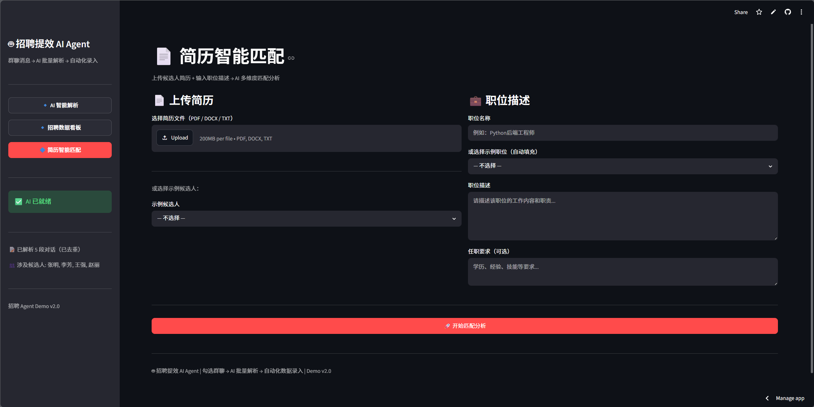

# 招聘提效 AI Agent — 演示文档

> **版本：** v2.0  
> **定位：** 面向 HR 的 AI 辅助招聘工具，将微信群聊中的非结构化招聘对话自动转化为结构化数据看板，并支持简历智能匹配。

---

## 一、首页 — AI 智能解析



首页即为核心工作区「**💬 AI 智能解析**」，左侧为功能导航栏，右侧为主操作区。

### 侧边栏导航

三个大按钮切换不同功能模块，当前激活的页面高亮为蓝色实心按钮：

| 按钮 | 功能 |
|---|---|
| 🔷 **AI 智能解析** | 核心解析页，群聊 → 结构化数据 |
| 🔹 **招聘数据看板** | 解析结果自动汇总为可视化看板 |
| 🔹 **简历智能匹配** | 上传简历 + JD，AI 多维匹配评分 |

侧边栏底部显示 AI 连接状态（✅ AI 已就绪）及已解析数据摘要。

### 主操作区三步骤

**① 选择要解析的群聊对话（可多选）**

- 提供 6 段模拟招聘群聊场景（涵盖推简历、面试安排、面试反馈、薪资讨论、录用决策、入职跟进）
- 支持 **全选 / 清空** 一键操作
- 每个场景单独勾选，显示候选人姓名和消息条数
- 支持 **导入 .txt** 文件批量添加外部对话数据

**② 预览选中对话**

- 勾选后自动将选中对话拼接为预览文本
- 支持手动编辑、粘贴自己的群聊记录
- 实时显示当前已勾选数量

**③ 执行 AI 解析**

- 点击「🤖 AI 解析」按钮，逐条调用 LLM 提取结构化数据
- 自动去重，避免重复解析
- 显示解析进度条和 API 调用证据（模型名、耗时、Token 用量）

---

## 二、解析结果与历史



### 解析历史卡片

每条解析结果以可展开卡片形式展示：

- **API 调用证据：** 模型名、响应延迟、Token 消耗
- **关键决策 & 待办：** AI 自动提取的决策摘要和行动项
- **候选人信息卡片：**
  - 👤 姓名、应聘职位
  - 📊 面试评分 / 100
  - ✅ 优势 & ⚠️ 关注点
  - 📅 面试时间、面试官
  - 💰 薪资讨论（期望 / 预算 / 结论）
  - 🟢/🔴/🟡 决策结果（推进 / 淘汰 / 待定）
- **原始消息 & 调试：** 可展开查看原始群聊文本和 API 原始返回（需勾选 🔬 调试）
- **删除操作：** 支持单条删除或清空全部历史

### 关联简历

勾选对话后，页面底部自动展示对应候选人的完整简历（教育背景、工作经历、项目经验、技能等）。

---

## 三、招聘数据看板



解析结果自动汇总到看板，无需手动录入。页面包含 **三个子视图**：

### KPI 指标卡

顶部 5 个指标卡片实时展示：
- 📋 开放岗位数
- 👥 候选人总数
- 📅 已安排面试数
- ✅ 通过率
- 📊 全流程跟踪率

### 管道漏斗图

按招聘阶段（简历筛选 → 面试中 → Offer → 入职）展示候选人分布，颜色区分不同阶段。

### 候选人列表 & 面试日程

- **候选人列表：** 表格展示所有候选人详细信息
- **面试日程：** 卡片式面试日历，按时间排列

### 数据导出

支持导出为 CSV 文件，文件命名含日期。

---

## 四、简历智能匹配



左右双栏布局，上传简历 + 填写 JD → AI 多维度匹配分析。

### 左侧 — 简历输入

- **上传简历文件：** 支持 PDF / DOCX / TXT 格式，AI 自动解析
- **示例候选人：** 内置 10 位候选人简历，可快速选择体验

### 右侧 — 职位描述

- **职位名称：** 手动输入
- **示例职位：** 内置 3 个职位 JD（Python后端、前端开发、高级产品经理），选择后自动填充
- **职位描述 & 任职要求：** 可编辑文本框

### 匹配结果

点击「🚀 开始匹配分析」后，AI 从 **8 个维度** 进行评分：

| 维度 | 说明 |
|---|---|
| 技能匹配 | 技术栈是否对口 |
| 经验匹配 | 工作年限与岗位要求 |
| 项目质量 | 过往项目复杂度与相关性 |
| 公司背景 | 上家公司的行业与规模 |
| 学历匹配 | 学历是否达标 |
| 职位相关度 | 整体岗位契合度 |
| 薪资匹配 | 期望薪资与预算区间 |
| 稳定性 | 跳槽频率与职业规划 |

结果展示：
- 🎯 **综合匹配评分**（0-100），80+ 绿色高亮推荐
- 📊 **8 维度雷达**，每项独立评分 + 进度条
- ✅ **优势清单** & ⚠️ **关注点**（左右分栏）
- 💡 **AI 建议**（下一步行动建议）

---

## 技术架构一览

```
用户浏览器 (Streamlit UI)
        │
        ▼
┌─────────────────────────────────┐
│           app.py                │
│  三 Tab 页面 + 侧边栏导航       │
└──────────┬──────────────────────┘
           │
    ┌──────┼──────┬──────────────┐
    ▼      ▼      ▼              ▼
chat_parser  dashboard  resume_parser  ai_match
(群聊解析)   (数据看板)  (简历解析)    (智能匹配)
    │                        │              │
    └────────┬───────────────┴──────────────┘
             │
             ▼
     DeepSeek API (LLM)
```

- **前端：** Streamlit（Python）
- **AI：** DeepSeek Chat API（OpenAI 兼容）
- **数据：** Session State 内存存储 + 自动去重
- **配置：** `.streamlit/secrets.toml` 后端注入，前端不暴露

---

## 快速开始

```bash
# 1. 安装依赖
pip install -r requirements.txt

# 2. 配置 API Key（编辑 .streamlit/secrets.toml）
OPENAI_API_KEY = "你的DeepSeek API Key"
OPENAI_API_BASE = "https://api.deepseek.com/v1"

# 3. 启动
streamlit run app.py
```

浏览器打开 `http://localhost:8501` 即可使用。
